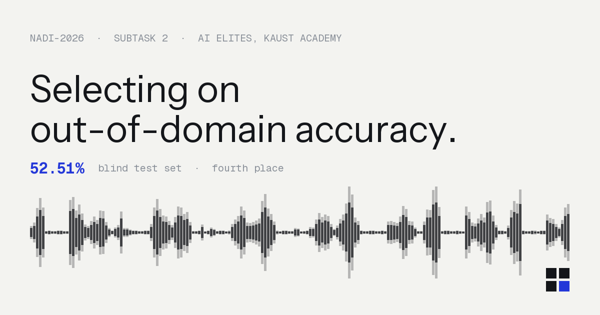

<p align="center">
  
</p>

# Arabic Spoken Dialect Identification

> **NADI-2026 Shared Task — Subtask 2 · fourth place**
> Country-level spoken Arabic dialect identification under domain shift, by fine-tuning an
> Arabic ASR encoder and selecting on out-of-domain accuracy.

`KAUST Academy` · `Python 3.10+` · `PyTorch`

**Paper:** *AI Elites at NADI 2026 Shared Task: Selecting on Out-of-Domain Accuracy for
Cross-Domain Spoken Arabic Dialect Identification*
**Landing page:** <https://asdi-sigma.vercel.app>

---

## Contents

- [Results](#results)
- [The task](#the-task)
- [Data](#data)
- [Approach](#approach)
- [Repository structure](#repository-structure)
- [Setup](#setup)
- [Training pipeline](#training-pipeline)
- [Generating a submission](#generating-a-submission)
- [Landing page](#landing-page)
- [Credits](#credits)
- [Notes](#notes)

---

## Results

The submitted system, ordered by increasing distance from the training domain.

| Evaluation set | Accuracy | C<sub>avg</sub> |
| --- | ---: | ---: |
| ADI20-micro — in-domain | 91.54 | 0.046 |
| Casablanca — **in-corpus**, its training portion is in the mixture | 92.97 | 0.014 |
| MADIS-5 — out-of-domain, scored over 5 macro-regions | 73.10 | — |
| **Blind test — official** | **52.51** | **0.11** |

Fourth place. The in-domain to blind gap is 39.03 points; moving to a held-out out-of-domain
corpus accounts for at most 18.44 of them, leaving 20.59 invisible to every development signal
available at the time.

Two findings are worth more than the score. Selecting on out-of-domain accuracy chose an encoder
that in-domain accuracy would have rejected by 32 points on MADIS-5. And a corpus stops being a
valid selection signal the moment it enters the training mixture — which is what happened to
Casablanca here, and why its number sits *above* in-domain accuracy rather than below it.

---

## The task

Given an Arabic speech clip, predict the speaker's country — 20 classes:

```
MSA  BAH  TUN  ALG  EGY  IRA  JOR  KSA  KUW  LEB
LIB  MAU  MOR  OMA  PAL  QAT  SUD  SYR  UAE  YEM
```

Two properties of the task drive most of the design here:

| Property | Consequence |
| --- | --- |
| The column order above is fixed by the task and is **not** alphabetical | Every file written by this repo uses it verbatim, asserted at startup |
| The submission has **no sample-ID column** — row *i* is scored against test row *i* | Row alignment is load-bearing; a one-row shift scores at chance and looks like a modelling failure |

The test set is 878 clips.

## Data

| Corpus | Role | Access |
| --- | --- | --- |
| [`UBC-NLP/NADI_2026_ADI20_micro`](https://huggingface.co/datasets/UBC-NLP/NADI_2026_ADI20_micro) | Primary training and in-domain validation. 67,015 train / 10,806 validation clips over 20 classes, balanced by duration rather than clip count. | organizer-released |
| [`UBC-NLP/Casablanca`](https://huggingface.co/datasets/UBC-NLP/Casablanca) | Secondary domain. Covers 8 of the 20 classes. Split at the **program** boundary — clips from one broadcast share a speaker and a recording chain, so a clip-level split would leak. | gated |
| [`badrex/MADIS5-spoken-arabic-dialects`](https://huggingface.co/datasets/badrex/MADIS5-spoken-arabic-dialects) | Out-of-domain evaluation only, never trained on. Labelled over five macro-regions, so predictions are mapped from the 20-way argmax under a fixed lookup. | public |

Casablanca is used two ways, and the distinction matters: it is genuinely out-of-domain during
backbone selection, and **in-corpus** for the final system, where its training portion has
entered the mixture and its accuracy is no longer evidence of transfer. MADIS-5 is the only
corpus in the project that is never trained on.

## Approach

Fine-tune the encoder of
[`CohereLabs/cohere-transcribe-arabic-07-2026`](https://huggingface.co/CohereLabs/cohere-transcribe-arabic-07-2026)
(gated) with a classification head over mask-aware pooled encoder states.

The hard part is **not** in-domain accuracy — it is the in-domain/out-of-domain gap. The model
fits ADI-20 comfortably while generalizing considerably worse to broadcast-style audio like the
hidden test set. Everything below exists to attack that gap:

- **Stable optimization.** One optimizer built up front with per-group learning rates and LLRD;
  only `requires_grad` is ever flipped, so the optimizer and scheduler objects never change. A
  frozen-encoder warmup at a high head LR keeps the head from being near-random when the encoder
  unfreezes. bf16 autocast, gradient accumulation to a real effective batch, and frozen BatchNorm
  running statistics.
- **Train/eval consistency.** Crop lengths are drawn per *batch*, so training and evaluation pool
  comparable numbers of frames rather than ~50 against ~375.
- **Program-disjoint splitting.** Casablanca (TV/broadcast) is split by *program*, not by clip,
  into a checkpoint-selection half and a held-out half. The held-out number never influences
  checkpoint choice, so it is not measured on the clips that chose the checkpoint.
  **Caveat, and it is the paper's main finding:** once Casablanca's training portion enters the
  mixture, that number stops being evidence of transfer and becomes a measure of in-domain fit.
  MADIS-5 is the only corpus here that is never trained on.
- **Augmentation** behind `--aug`, tiered by CPU cost so the cheap ones run inside the dataloader
  workers.
- **Optional architecture levers**, all default-off and testable one at a time: `--layer-mix`
  (learned softmax weighting over *all* encoder layers rather than just the last — dialect cues
  sit disproportionately in intermediate layers of an ASR encoder), `--lora` (low-rank adapters
  as a regularizer), `--tta` (multi-crop test-time averaging).

## Repository structure

```
.
├── src/
│   ├── train.py          fine-tuning pipeline: data, augmentation, training loop,
│   │                     evaluation, diagnostics and plots
│   ├── submit.py         runs a checkpoint over the test set and writes the
│   │                     competition submission
│   ├── export_site.py    orchestrator: builds every data file the landing page
│   │                     reads, then packages them for transfer
│   ├── export_demo.py    runs a checkpoint over real clips and writes demo.json
│   │                     plus the audio the page plays
│   ├── export_ledger.py  turns results/runs.csv into ledger.json
│   ├── placeholder_demo.py  synthetic demo data, flagged synthetic:true, so the
│   │                     page can be built without GPU access
│   └── set_base.py       stamps the public URL into canonical, Open Graph and
│                         sitemap entries
├── site/                 the landing page — static, self-contained, no build step
│   ├── index.html
│   ├── 404.html
│   └── data/             demo.json + audio/, written by src/export_site.py
├── notebooks/
│   └── test_gap_diagnosis.ipynb
│                         executed investigation of the validation-to-leaderboard gap
├── results/              Weights & Biases export
│   ├── runs.csv          one row per run: config, metrics, environment
│   ├── runs.json         same, nested
│   └── history/          per-run metric history, one CSV per run
├── requirements.txt
├── .env.example          template for the two required credentials
└── .gitignore
```

Every script is a standalone CLI — there is nothing to install as a package. The one exception to
"no shared module" is `export_demo.py`, which imports `submit.py` deliberately, so the numbers on
the page come from the same verified inference path as the submission rather than a second copy of
it that could drift. **Run them from the repository root** so their outputs land there rather than
in `src/`.

## Setup

```bash
git clone https://github.com/musab-iskandar/Arabic_Spoken_Dialect_Identification && cd Arabic_Spoken_Dialect_Identification
python -m venv .venv && source .venv/bin/activate    # Windows: .venv\Scripts\activate

pip install torch torchaudio        # install the pair FIRST, in one command
pip install -r requirements.txt
```

Installing `torch` and `torchaudio` in a single command is not a style preference: resolving them
separately is how you end up with a `torchaudio` built against a different libtorch, which fails
at import with `undefined symbol: torch_library_impl`. `src/train.py` installs its own
dependencies on startup and pins any pre-existing pair for the duration so pip cannot move them —
pass `--skip-install` once you have run the commands above.

`torchaudio` itself is optional; only the default-off `codec` augmentation needs it.

### Credentials

Read from the environment only — there is nothing to edit in the source. Copy `.env.example` to
`.env` and export:

```bash
export HF_TOKEN=...          # https://huggingface.co/settings/tokens
export WANDB_API_KEY=...     # https://wandb.ai/authorize  (or pass --no-wandb)
```

The HF token needs **gated access** to
[`CohereLabs/cohere-transcribe-arabic-07-2026`](https://huggingface.co/CohereLabs/cohere-transcribe-arabic-07-2026)
and [`UBC-NLP/Casablanca`](https://huggingface.co/datasets/UBC-NLP/Casablanca). The ADI20-micro
and MADIS-5 datasets need no special access. Every script stops immediately with the export line
to copy if a credential is missing, rather than failing later inside a download.

---

## Training pipeline

### 0. Verify the environment before spending GPU time

Three self-tests, each cheaper than the one after it. Run them in order — each rules out a
distinct class of failure, and the first two need no credentials at all.

```bash
python src/train.py --plot-selftest    # no torch, no GPU, no downloads, no credentials
python src/train.py --aug-selftest     # torch only: times and validates every augmentation
python src/train.py --smoke-only       # synthetic audio through the real model (needs HF_TOKEN)
python src/train.py --preflight        # smoke test + full data load, then exit before training
```

For a fast end-to-end check of the whole pipeline on real data without the full download:

```bash
python src/train.py --quick-data 50 --max-steps 20 --tag pipecheck
```

`--quick-data N` streams ~N real examples per class and implies `--skip-ood`.

### 1. Launch a run

The defaults are a complete, tuned recipe — this is a real run, not a placeholder:

```bash
python src/train.py --tag baseline
```

A more representative configuration, enabling augmentation and the layer-mix head:

```bash
python src/train.py \
    --tag lm_aug \
    --aug noise,reverb,speed \
    --layer-mix \
    --max-steps 6000
```

> [!IMPORTANT]
> **Always pass `--tag` when you change a flag.** Output paths and the internal run name are
> derived from `--layer-mix` / `--lora` / the data flags *plus* `--tag`. Two runs that differ only
> by, say, `--llrd` resolve to the same results file, and the second is **silently skipped** with a
> single `SKIP (done)` line. `--tag` is what keeps them distinct.

### 2. What a run produces

All paths are resolved to absolute at startup and are gitignored.

| Output | Contents | Change it with |
| --- | --- | --- |
| `best_<run>_cohere-ar.pt` | Best checkpoint, selected on `--select-metric` | `--tag` |
| `cohere_train_v5_results.jsonl` | One row per completed run | `--results` |
| `cohere_train_v5_progress.jsonl` | Mid-training evaluations, appended as they happen | `--progress` |
| `cohere_train_v5_table.csv` | Summary table across runs | fixed |
| `loss_history_v5.csv` | Per-step loss, gradient norm, learning rates | `--loss-csv` |
| `plots_v5/` | Loss/accuracy/gradient plots, refreshed every `--plot-every` steps | `--plots-dir` |
| `spike_report_v5.txt` | Gradient-norm percentiles and instability detection | `--spike-report` |
| `cohere_train_v5_run.log` | Full console transcript | follows `--results` |

The `_v5` in these names is the script's own lineage, not a repo version — see [Notes](#notes).
The run log is derived from `--results`, so renaming that renames the log with it.

Metrics also stream to Weights & Biases unless `--no-wandb`. The `<run>` component is assembled
from the enabled flags and your `--tag` — the run prints the exact checkpoint path when it saves,
so read it from there rather than reconstructing it.

Watch two numbers in particular: **`casa_acc_holdout`** (program-disjoint out-of-domain accuracy —
the honest generalization figure) and the gap between it and in-domain validation accuracy.
Training accuracy is plotted against the eval curves so a widening gap is visible directly.

### 3. Tuning

**Optimization**

| Flag | Default | Notes |
| --- | --- | --- |
| `--max-steps` | `6000` | Cosine decays the LR to zero at this value |
| `--lr` | `2e-5` | Encoder learning rate |
| `--head-lr` | `2e-3` | Classification head; deliberately ~100× the encoder |
| `--llrd` | `1.0` | Layerwise LR decay; `<1.0` slows lower layers |
| `--frozen-steps` | `500` | Encoder frozen for this many steps while the head warms up |
| `--clip-norm` | `3.0` | Read the next value off the spike report's percentiles |
| `--label-smoothing` | `0.1` | Over 20 classes this puts the loss floor at 0.594, not 0 |
| `--weight-decay` | `0.01` | |

**Batching and throughput**

| Flag | Default | Notes |
| --- | --- | --- |
| `--effective-batch` | `128` | Real batch after gradient accumulation |
| `--batch-size` | auto | Micro-batch; derived from `--effective-batch` if unset |
| `--precision` | `bf16` | fp16's speed and memory with fp32's range |
| `--num-workers` | `24` | Lower it on a smaller box |
| `--compile` | on | `--no-compile` to disable |

**Data and augmentation**

| Flag | Default | Notes |
| --- | --- | --- |
| `--aug` | *(none)* | Comma-separated. Cheap: `noise,reverb,speed,gain`. Expensive: `pitch,codec`. Suggested start: `noise,reverb,speed` — the channel augs that match broadcast audio |
| `--aug-prob` | `0.5` | Per-sample probability for each enabled cheap aug |
| `--specaug` | off | SpecAugment on top of the waveform augs |
| `--subset` | `1.0` | Fraction of ADI-20 train/val to use |
| `--train-on-casa` | off | Recover the Casablanca half that program-disjoint splitting otherwise discards. **Costs you the independent OOD estimate** |
| `--use-adi17` | off | ADI-17 overlaps ADI-20 heavily — expect little from it |
| `--casa-select-frac` | `0.5` | Selection/held-out split of Casablanca |

**Architecture and evaluation**

| Flag | Default | Notes |
| --- | --- | --- |
| `--layer-mix` | off | Learned weighting over all encoder layers; also reports *which* layers the task uses |
| `--lora` | off | Low-rank adapters, encoder otherwise frozen (`--lora-rank`, default `16`) |
| `--pool` | `mean` | Also `mean_std`, `attn_stat` |
| `--tta` | `0` | Multi-crop test-time averaging; eval-side only, costs no training compute |
| `--eval-every` | `400` | Steps between evaluations |
| `--select-metric` | `casa_acc` | 20-way Casablanca accuracy on the selection half. `casa_acc8` selects on the 8-way restricted argmax instead — the two can move in opposite directions |

Run `python src/train.py --help` for the complete list; every flag carries an explanation of why
its default is what it is.

### 4. Evaluate a finished checkpoint

One evaluation pass with a confusion matrix, no optimizer and no training compute:

```bash
python src/train.py --eval-checkpoint best_v3_lm_baseline_cohere-ar.pt --confusion
```

This is the cheap way to find out *where* a run's errors actually are before launching another one.

---

## Generating a submission

```bash
python src/submit.py --checkpoint best_v3_lm_baseline_cohere-ar.pt --tag baseline
```

Writes `submissions/<tag>/` containing `logits.tsv`, `predictions.tsv`, `submission.zip` and
`meta.json`.

Given that a misaligned submission is indistinguishable from a bad model, this script is
deliberately defensive:

- **Architecture flags are inferred from the checkpoint's own keys**, and *any* missing or
  unexpected key is fatal — a silent `strict=False` partial load would still run and still predict.
- **Results are scattered into a pre-allocated array by a carried row index**, so an undecodable
  clip leaves a neutral row in place instead of shifting every later row up by one. Any drop is
  reported loudly and is fatal by default.
- **Files are truncated, not appended**, and line counts are re-verified after writing.
- **A sample of the ADI-20 validation split is re-scored** through this script's own code path
  (`--verify`, on by default) to catch divergence from the trainer.

Useful options: `--tta N` for multi-crop averaging, `--no-verify` to skip the validation pass
(faster, less safe), `--limit N` for a quick partial run.

## Landing page

`site/` is a static page with no build step and no framework: one HTML file, its data, and the
clips. It plays real audio through the model's real posteriors, so it needs an export first.

```bash
# on a machine with the checkpoint and a GPU
python src/export_site.py \
    --checkpoint best_v3_lm_casatr_v6_cohere-ar.pt \
    --casa-val-frac 0.2 --casa-select-frac 0.5 --seed 42 \
    --pool-size 1500
```

The split flags **must match what the checkpoint was trained with**. If they do not, the "held-out"
clips may be ones that checkpoint trained on, and the demo becomes quietly dishonest with nothing
to warn you. The exporter prints the pool accuracy it measured for exactly this reason — compare
it against that run's logged `casa_acc_holdout` before trusting the output.

That writes `site/data/` and a `site-data.tar.gz` to copy back. Then:

```bash
tar -xzf site-data.tar.gz -C site/
cd site && python -m http.server 8731
```

Serving over HTTP is not optional: `fetch()` is blocked on `file://`, so opening `index.html`
directly falls back to the built-in placeholder numbers and shows a banner saying so.

The clip selection is deliberately mixed rather than flattering — `--correct-frac` (default 0.75)
sets how many of the exported clips the model got right, and the page states the ratio in words.
A demo that only shows wins is an advertisement.

## Credits

**Datasets.** This work would not exist without three openly released corpora:

- [`UBC-NLP/NADI_2026_ADI20_micro`](https://huggingface.co/datasets/UBC-NLP/NADI_2026_ADI20_micro)
  — the shared task's ADI-20 subset, used for training and in-domain validation.
- [`UBC-NLP/Casablanca`](https://huggingface.co/datasets/UBC-NLP/Casablanca) — Talafha et al.,
  2024. Broadcast speech across Arabic dialects; the secondary domain here.
- [`badrex/MADIS5-spoken-arabic-dialects`](https://huggingface.co/datasets/badrex/MADIS5-spoken-arabic-dialects)
  — Abdullah et al., 2025. A manually curated cross-domain benchmark, and the only corpus in this
  project that is never trained on.

**Model.**
[`CohereLabs/cohere-transcribe-arabic-07-2026`](https://huggingface.co/CohereLabs/cohere-transcribe-arabic-07-2026)
— the Arabic ASR encoder the final system fine-tunes.

**Shared task.** NADI-2026 Subtask 2, and the NADI organisers for running the benchmark.

## Notes

- The internal run name is prefixed `v3` for continuity with the run histories in `results/`;
  it does not indicate the code version.
- Comments in `src/` reference earlier iterations of this project (`cohere_train_v3.py`,
  `cohere_bench.py`, and others) that are not part of this repository. They are retained as
  provenance for why specific defaults and workarounds exist.
